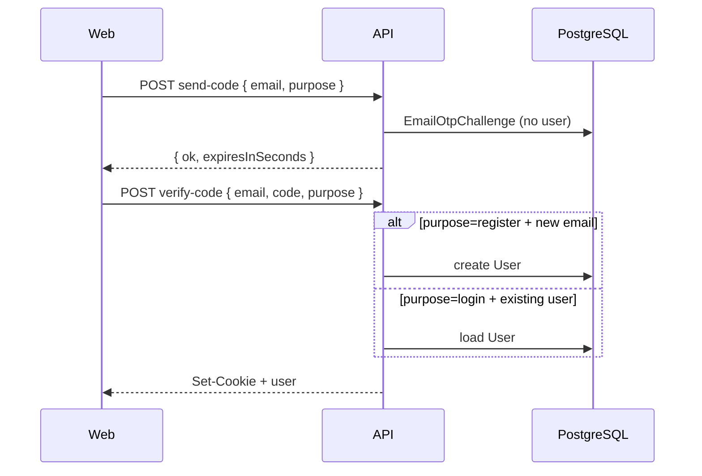

# Auth — Email OTP (implemented)

> Passwordless email qua **6-digit code** (Resend). User **chỉ được tạo khi `verify-code` + `purpose=register` thành công**.  
> Web: `/login` và `/register` · REST only.

## Quyết định sản phẩm

| Mục | Chốt |
|-----|------|
| Routes web | `/login` và `/register` — `purpose` cho email copy |
| Verify (unified) | OTP đúng → create nếu mới, login nếu đã có |
| `send-code` | Gửi mail + lưu challenge — **không** tạo user |
| Mã | **6 chữ số**, TTL **10 phút** |
| Email | **Resend** — template **English** |
| Password API | **Giữ** `POST login` / `register` cho admin/dev |

## Endpoints

### `POST /api/auth/email/send-code`

```json
{ "email": "user@example.com", "purpose": "login" }
```

`purpose`: `"login"` \| `"register"`

**Server:** normalize email → rate limit → xóa challenge cũ (email + purpose) → sinh mã → hash → insert `email_otp_challenges` → Resend.

```json
{ "ok": true, "expiresInSeconds": 600 }
```

### `POST /api/auth/email/verify-code`

```json
{ "email": "user@example.com", "code": "123456", "purpose": "register" }
```

- **`purpose=register` / `purpose=login`:** chỉ dùng để tìm challenge + copy email Resend.
- OTP đúng:
  - Chưa có user → `create` (`emailVerifiedAt: now`, `passwordHash: null`)
  - Đã có user, chưa verify → `update emailVerifiedAt`
  - Đã verify → `issueTokenPair`
- Đánh dấu challenge `usedAt`, Set-Cookie.

### `POST /api/auth/email/resend-code`

Cùng body `send-code`, cooldown **60s** / email + purpose.

## Database

```prisma
enum EmailOtpPurpose { login register }

model EmailOtpChallenge {
  id        String          @id @default(cuid())
  email     String
  purpose   EmailOtpPurpose
  codeHash  String          @unique
  attempts  Int             @default(0)
  expiresAt DateTime
  usedAt    DateTime?
  createdAt DateTime        @default(now())

  @@index([email, purpose])
}
```

Migration: `20250630120000_add_email_otp_challenges`

## Env

```env
EMAIL_OTP_EXPIRES_MINUTES=10
EMAIL_OTP_RESEND_COOLDOWN_SECONDS=60
EMAIL_OTP_MAX_ATTEMPTS=5
RESEND_API_KEY=
EMAIL_FROM="Aucobot <noreply@aucobot.com>"
```

## Email subjects (EN)

| Purpose | Subject |
|---------|---------|
| register | Your Aucobot sign-up code |
| login | Your Aucobot sign-in code |

Template: `core/email/templates/otp-email.template.ts`

## Endpoints giữ nguyên (admin/dev)

| Endpoint | Ghi chú |
|----------|---------|
| `POST /api/auth/login` | Password |
| `POST /api/auth/register` | Password + link verify |
| `POST /api/auth/verify-email` | Link token — legacy |
| `GET /api/auth/google` | OAuth — web dùng |

## Shared Zod (`@aucobot/shared`)

- `emailOtpPurposeSchema`
- `sendEmailCodeSchema` / `verifyEmailCodeSchema` / `resendEmailCodeSchema`

## Sequence



